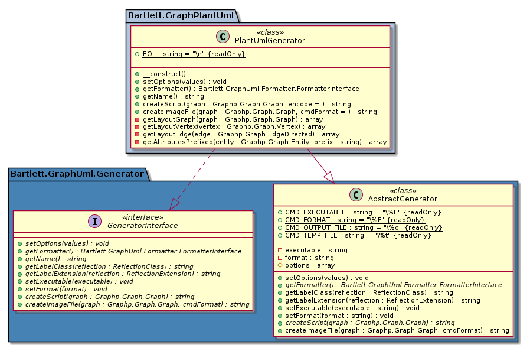

[](https://packagist.org/packages/bartlett/graph-plantuml-generator)
[](https://php.net/)

# bartlett/graph-plantuml-generator

Generate UML diagrams in [PlantUML](https://plantuml.com/) format.

> Note: This project is in beta stage! Feel free to report any issues you encounter.

## Features

The main features provided by this library are:

* build UML statements of a class diagram
* build image in one of the [supported formats](https://plantuml.com/en/command-line) with local `plantuml.jar` executable

## Install

The recommended way to install this library is [through composer](http://getcomposer.org).
If you don't know yet what is composer, have a look [on introduction](http://getcomposer.org/doc/00-intro.md).

```bash
composer require bartlett/graph-plantuml-generator
```

Additionally, you'll have to install PlantUML jar and Java Runtime (java executable).
Users of Debian/Ubuntu-based distributions may simply invoke:

```bash
$ sudo apt update
$ sudo apt-get install openjdk-11-jre-headless
```

while remaining users should install from [PlantUML Download](https://plantuml.com/fr/download) page.

You can also use the PlantUML demo server at http://www.plantuml.com/plantuml/uml/

## Quick Start

Once [installed](#install), you can use the following code to draw an UML class
diagram for your existing classes:

```php
<?php

use Bartlett\GraphUml\ClassDiagramBuilder;
use Bartlett\GraphPlantUml\PlantUmlGenerator;

use Graphp\Graph\Graph;

$generator = new PlantUmlGenerator();
$generator->setExecutable('vendor/bin/plantuml');
$graph = new Graph();
$builder = new ClassDiagramBuilder(
    $generator,
    $graph,
    [
        'label-format' => 'default',
    ]
);

$builder->createVertexClass(PlantUmlGenerator::class);

// personalize render
// https://plantuml.com/en/color
$graph->setAttribute($generator->getName() . '.graph.bgcolor', 'transparent');
$graph->setAttribute($generator->getName() . '.cluster.Bartlett\\GraphPlantUml.graph.bgcolor', 'lightsteelblue');
$graph->setAttribute($generator->getName() . '.cluster.Bartlett\\GraphUml\\Generator.graph.bgcolor', 'SteelBlue');

// show UML diagram statements
echo $generator->createScript($graph);
// default format is PNG
echo $generator->createImageFile($graph) . ' file generated' . PHP_EOL;
```

That should give such output:



## Documentation

TODO

## Resources

* Demo online [PlantUML Server](http://www.plantuml.com/plantuml/uml/).
* Official docker image of [PlantUML Server](https://hub.docker.com/r/plantuml/plantuml-server/) over Jetty or Tomcat.
* [PlantUML Server](https://github.com/plantuml/plantuml-server) is a web application to generate UML diagrams on-the-fly.
* [PlantText](https://www.planttext.com/) is UML online editor.
* [Kroki](https://github.com/yuzutech/kroki) creates diagrams from textual descriptions.
* [Real World PlantUML](https://real-world-plantuml.com/) examples.
* Composer package to provide [PlantUML executable](https://github.com/Jawira/plantuml) and jar.
* [PlantUML Language Reference Guide (pdf)](http://plantuml.com/PlantUML_Language_Reference_Guide.pdf).
* [PlantUML encoding functions for PHP](https://github.com/jawira/plantuml-encoding).
* [Markdown native diagrams with PlantUML](https://blog.anoff.io/2018-07-31-diagrams-with-plantuml/) in GitLab or GitHub.

## Contributors

* Laurent Laville (Lead Developer)

[](https://sourcerer.io/fame/llaville/llaville/graph-plantuml-generator/links/0)
[](https://sourcerer.io/fame/llaville/llaville/graph-plantuml-generator/links/1)
[](https://sourcerer.io/fame/llaville/llaville/graph-plantuml-generator/links/2)
[](https://sourcerer.io/fame/llaville/llaville/graph-plantuml-generator/links/3)
[](https://sourcerer.io/fame/llaville/llaville/graph-plantuml-generator/links/4)
[](https://sourcerer.io/fame/llaville/llaville/graph-plantuml-generator/links/5)
[](https://sourcerer.io/fame/llaville/llaville/graph-plantuml-generator/links/6)
[](https://sourcerer.io/fame/llaville/llaville/graph-plantuml-generator/links/7)
