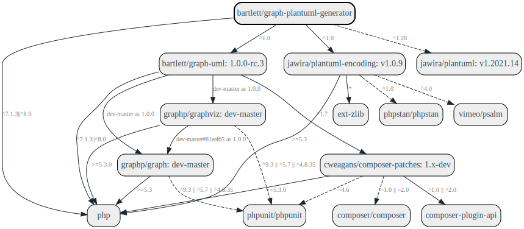

### Features

The main features provided by this library are:

* build UML statements of a class diagram in [PlantUML](https://plantuml.com) format
* draw png/svg/eps/pdf image formats

### Install

The recommended way to install this library is [through composer](http://getcomposer.org).
If you don't know yet what is composer, have a look [on introduction](http://getcomposer.org/doc/00-intro.md).

```bash
composer require bartlett/graph-plantuml-generator
```



Additionally, you'll have to install PlantUML jar and Java Runtime (java executable).
Users of Debian/Ubuntu-based distributions may simply invoke:

```bash
$ sudo sudo apt update
$ sudo apt-get install openjdk-11-jre-headless
```

while remaining users should install from [PlantUML Download](https://plantuml.com/fr/download) page.

You can also use the PlantUML demo server at http://www.plantuml.com/plantuml/uml/
